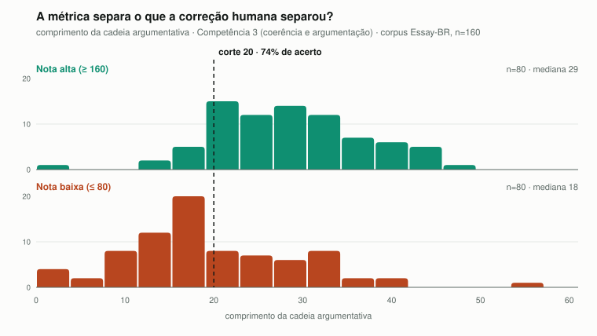

# Raio-X da Redação

**Número do Grupo:** 31 &nbsp;·&nbsp; **Conteúdo da Disciplina:** Grafos

Diagnóstico da estrutura argumentativa de redações do ENEM por meio de algoritmos em grafos direcionados.

## Alunos

| Matrícula | Aluno |
| --- | --- |
| 222006534 | Anna Clara Cardoso Evangelista Brandão |
| 231026699 | Eduarda Domingos Rodrigues |

## Sobre

Uma redação dissertativo-argumentativa bem construída encadeia ideias: o tema leva a uma causa, a causa a uma consequência, a consequência à proposta de intervenção. Quando um corretor sente que "o texto não anda", ele está percebendo uma propriedade estrutural — e a hipótese deste trabalho é que essa propriedade é **topológica**, calculável sobre um grafo direcionado das ideias do texto.

O aplicativo recebe a redação e devolve um diagnóstico visual: o mapa das ideias, a sequência que elas formam, os grupos de ideias que se puxam mutuamente, e a ligação entre o tema e a proposta. Cada aresta do grafo aponta para a frase original que a gerou, então o diagnóstico é **verificável** — o usuário confere a leitura em vez de acreditar nela.

Testamos a hipótese contra 160 redações já corrigidas por humanos. **Ela se confirmou para a Competência 3 e não se confirmou para as Competências 2 e 5.** Os números estão na seção de validação, e o programa só emite juízo onde a medição sustenta.

## Modelagem

**Vértices** são conceitos: o núcleo nominal lematizado de cada sintagma relevante, com seu adjetivo adnominal (`identidade cultural`, `política pública`).

**Arestas** são direcionadas e vêm da análise sintática de dependências: para cada verbo, o substantivo que é seu sujeito recebe uma aresta para o substantivo que é seu objeto. A frase *"a expansão do agronegócio provoca a expulsão de povos indígenas"* produz `agronegócio → expulsão`. Semanticamente, `u → v` significa **"u leva a / justifica v"**.

**Pesos** são o inverso da frequência da relação. Uma relação afirmada três vezes ao longo do texto está bem sustentada e é barata de percorrer; uma mencionada de passagem é cara. O caminho mínimo passa a ser o **argumento mais bem sustentado**, não apenas o mais curto em número de saltos. Como a frequência é sempre ≥ 1, os pesos ficam em (0, 1] — positivos, condição de validade do Dijkstra.

A extração aplica sete refinamentos sobre a regra base, cada um motivado por uma construção do português que a regra ingênua perde (substantivo leve, oração relativa, aposto entre vírgulas, coordenação, verbo subordinado, verbo mal etiquetado, coesão entre frases). Estão documentados em `src/extracao.py`, com o efeito medido de cada um.

## Algoritmos implementados

Todos foram **implementados do zero pela dupla**. Nenhuma biblioteca de grafos é utilizada — nem como dependência transitiva.

| Algoritmo | Complexidade | Papel no diagnóstico |
| --- | --- | --- |
| Tarjan (componentes fortemente conectados) | `O(V + E)` | Identifica grupos de ideias que se justificam mutuamente, e viabiliza a ordenação topológica em qualquer grafo |
| Kahn (ordenação topológica) | `O(V + E)` | Produz a sequência de ideias do texto — o indicador validado |
| Dijkstra (caminho mínimo, com heap) | `O((V + E) log V)` | Mede a ligação entre o tema e a proposta de intervenção |

> **Seção a completar pela Eduarda:** notas de implementação de cada algoritmo —
> escolhas de estrutura de dados, por que Tarjan em vez de Kosaraju, como a
> condensação entra antes do Kahn, e o cálculo do maior caminho no DAG.

### Decisões de escopo

- **Árvore Geradora Mínima ficou de fora.** Exige grafo não-direcionado, e ignorar a direção responderia quase à mesma pergunta que a sequência de ideias já responde, com menos significado.
- **A\* ficou de fora.** Exigiria o modelo `pt_core_news_md` (o `sm` não tem vetores de palavra: `nlp.vocab.vectors.shape == (0, 0)`), e a heurística de similaridade semântica não seria admissível — similaridade e peso `1/frequência` estão em escalas diferentes. Apresentar como A* sem essa ressalva seria impreciso.

## O que a validação mostrou

O script `validacao.py` compara redações que corretores humanos avaliaram bem e mal em uma competência, e reporta o ponto de corte que melhor separa os dois grupos.



| grupo | n | p25 | mediana | p75 |
| --- | --- | --- | --- | --- |
| Competência 3 alta (≥ 160) | 80 | 23 | 29 | 35 |
| Competência 3 baixa (≤ 80) | 80 | 12 | 18 | 27 |

**Sequência ≥ 20 ideias separa os dois grupos com 74% de acerto** (n = 160, semente fixa). É um indicador com força medida, não um classificador — erra cerca de uma redação em cada quatro, e o programa diz isso.

### O que não se sustentou

Duas hipóteses do desenho original **não** resistiram à medição, e ficam registradas porque resultado negativo também é resultado:

**A proposta desconectada do tema (C2 e C5).** O grafo de uma redação fica fragmentado em cerca de 6 componentes, e o maior deles segura apenas um terço dos conceitos — relações causais expressas dentro de frases isoladas não encadeiam um texto inteiro. Consequência: o caminho tema → proposta quase nunca existe, e quando existe aparece **mais** nas redações mal avaliadas em C5 (23%) do que nas bem avaliadas (12%). A métrica estava medindo fragmentação, não qualidade. Duas correções foram tentadas e medidas — arestas por conectivo discursivo, e vértices menos específicos — e levaram o maior componente de 28% para 34%, o que não muda a conclusão.

**A argumentação circular como defeito.** Medido em 400 redações: ciclo aparece em 3,2% dos textos, e a média de Competência 3 desses é **120 contra 113** nos textos sem ciclo — levemente melhor, não pior. E 8 dos 13 ciclos têm apenas dois conceitos, o que costuma ser relação mútua legítima (*"a pobreza compromete a educação, e a falta de educação perpetua a pobreza"*), não falácia. Por isso o programa reporta ciclo como **observação neutra**, nunca como alerta.

Esses dois achados mudam o papel do Tarjan no projeto: ele não pontua o texto, ele garante que o indicador de Competência 3 funcione em **toda** redação — sem a condensação dos componentes, o Kahn não ordena grafo cíclico e 3,2% dos textos perderiam o único diagnóstico validado.

## Estrutura do projeto

```
├── app.py                    interface Streamlit
├── validacao.py              compara a métrica com a nota humana; gera o gráfico
├── demo_caminhos.py          demonstração do Dijkstra pelo terminal
├── src/
│   ├── grafo.py              classe Grafo — lista de adjacência, sem biblioteca
│   ├── extracao.py           texto → grafo de conceitos (spaCy como sensor)
│   ├── alvos.py              qual conceito é o tema, quais são a proposta
│   ├── analise.py            Tarjan, Kahn, rastreabilidade e métricas
│   ├── caminhos.py           Dijkstra com heap
│   ├── diagnostico.py        junta tudo e traduz para as competências do ENEM
│   ├── corpus.py             carrega o Essay-BR com as notas por competência
│   └── visualizacao.py       gera o DOT do grafo
├── tests/                    172 testes; grafos pequenos com resposta conhecida
├── data/                     redação de exemplo (o corpus fica em data/raw, não versionado)
└── resultados/               saída da validação: gráfico, tabela e dados brutos
```

## Instalação

```bash
python -m venv .venv
source .venv/bin/activate          # Windows: .venv\Scripts\Activate.ps1
pip install -r requirements.txt
python -m spacy download pt_core_news_sm
```

## Uso

Interface:

```bash
streamlit run app.py
```

Diagnóstico de um arquivo, pelo terminal:

```bash
python -m src.diagnostico data/exemplo_sintetico_com_laco.txt "Título da redação"
```

Extração do grafo, para inspeção:

```bash
python -m src.extracao data/exemplo_sintetico_com_laco.txt
```

Validação no corpus (requer o Essay-BR baixado — instruções em `src/corpus.py`):

```bash
python validacao.py                     # Competência 3, métrica padrão
python validacao.py --competencia 5     # a competência que não se sustenta
```

## Testes

```bash
python -m unittest discover -s tests -t .
```

**172 testes.** Os que dependem do spaCy ou do corpus são pulados automaticamente quando eles não estão presentes, então a suíte roda em um clone recém-feito.

Os grafos de teste estão em `tests/grafos_exemplo.py` e têm resposta conhecida de antemão — incluindo o grafo da figura 22.9 do Cormen, o exemplo canônico de componentes fortemente conectados. Quando um teste falha, o problema está no algoritmo, nunca na expectativa.

O limiar de 20 tem um teste dedicado (`tests/test_diagnostico.py::TestCalibragem`): mexer no número sem refazer a medição no corpus quebra a suíte.

## Corpus

[Essay-BR](https://github.com/rafaelanchieta/essay) — 4.570 redações de estudantes do ensino médio brasileiro, com nota por competência. Licença MIT. Fica em `data/raw/`, que não é versionado.

A nota separada por competência é o que torna a validação possível: as métricas afirmam detectar problemas de competências específicas, e o corpus permite verificar competência por competência em vez de contra a nota total.

## Apresentação

`<link do vídeo>`

## Origem do tema

O tema nasceu do interesse das autoras por análise automática de redações, explorado antes em um trabalho de outra disciplina que modelava o texto como uma rede **não-direcionada** de coocorrência de palavras. A modelagem em grafo direcionado, o diagnóstico estrutural e todos os algoritmos deste repositório são novos e foram desenvolvidos para esta disciplina.

## Referências

- CORMEN, T. H. et al. *Introduction to Algorithms*. 3. ed. Capítulos 22 a 24.
- MARINHO, J.; ANCHIÊTA, R.; MOURA, R. *Essay-BR: a Brazilian Corpus of Essays*. 2021.
- BRASIL. INEP. *A redação no ENEM: cartilha do participante* — matriz de competências.
